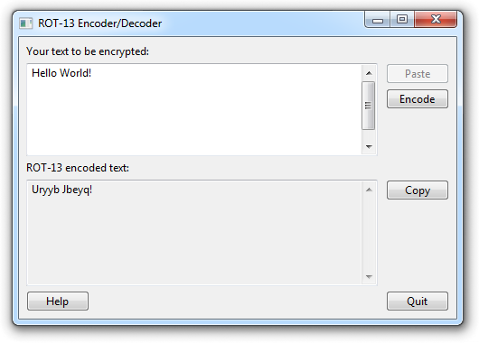

Vala Bindings for Native Windows Controls
=========================================

Though Vala is a quite capable language, when it comes to GUI programming, you don't have a lot of choice, or the choice should I say. The computer I use on a daily basis is a Linux machine with a GNOME desktop environment, so GTK is a reasonable choice for me to use when in need of a GUI toolkit, and I'm happy with that. But when I need to write an application that is supposed to run on Windows, I'd really prefer the look and feel of a native application. Hence the aim of this project is to provide the means of creating a Windows application with the native controls *(widgets)* using Vala.

Below is a screen shot of the sample application of which you can find the source code [here](examples/encryptor.vala). If you'd like to try it out first, you can download the compiled binary [here](https://github.com/emrevit/vala-win32/releases/download/Samples/samples_v0.1_win_x86_64.zip).

<p align="center">
  
</p>

__Please Note:__ For the time being, this project is highly experimental and lacks a lot. I have the intention of building a library out of this eventually, but the progress will be really slow (*I really don't have much time.*)


Building
-------------------------------------------

The sample application is compiled on Ubuntu 20.04 and tested with Wine. The following instructions explain how to do so on Ubuntu. If you'd like to compile on a Windows machine, you can use [MSYS2](https://www.msys2.org/).

We'll use the C compiler provided by the Mingw-w64 project to cross-compile. You can install the development environment for 32-bit and 64-bit Windows applications by the following command (*if you don't have the development tools package installed already, install the `build-essential` package beforehand*):

```shell
sudo apt install mingw-w64
```

after the installation you'll have the following commands at your disposal:

```shell
i686-w64-mingw32-gcc    # 32-bit C compiler for Windows
x86_64-w64-mingw32-gcc  # 64-bit C compiler for Windows
i686-w64-mingw32-g++    # 32-bit C++ compiler for Windows
x86_64-w64-mingw32-g++  # 64-bit C++ compiler for Windows
```

We'll compile the C code generated by the Vala compiler ourselves. To cross-compile the C source, we'll need the Windows specific headers for *GLib, GIO, GObject,* and the other libraries we'll use. Unfortunately, Ubuntu doesn't have these headers and the binaries we'll need at the runtime in its repositories (*Fedora does, by the way,*) so we'll use the ones from the MSYS2 project.

First, create a directory where we'll place the Windows-specific libraries:

```shell
mkdir -p /your/path/to/libs
cd /your/path/to/libs
```

Download the libraries and their dependencies from the MSYS2 project (*as your project grows, you'll need to download additional libraries as well*):

```shell
wget https://repo.msys2.org/mingw/mingw32/mingw-w64-i686-glib2-2.72.3-1-any.pkg.tar.zst \
     https://repo.msys2.org/mingw/mingw32/mingw-w64-i686-pcre-8.45-1-any.pkg.tar.zst \
     https://repo.msys2.org/mingw/mingw32/mingw-w64-i686-zlib-1.2.12-1-any.pkg.tar.zst \
     https://repo.msys2.org/mingw/mingw32/mingw-w64-i686-libgee-0.20.5-2-any.pkg.tar.zst \
     https://repo.msys2.org/mingw/mingw32/mingw-w64-i686-libffi-3.3-4-any.pkg.tar.zst \
     https://repo.msys2.org/mingw/mingw32/mingw-w64-i686-gcc-libs-12.1.0-3-any.pkg.tar.zst \
     https://repo.msys2.org/mingw/mingw32/mingw-w64-i686-libiconv-1.17-1-any.pkg.tar.zst \
     https://repo.msys2.org/mingw/mingw32/mingw-w64-i686-gettext-0.21-3-any.pkg.tar.zst \
     https://repo.msys2.org/mingw/mingw32/mingw-w64-i686-libwinpthread-git-10.0.0.r59.gaacb650be-1-any.pkg.tar.zst
```

Extract the packages:

```shell
for f in *.tar.zst; do tar --zstd -xf "$f"; done
```

For the `pkg-config` to function properly, we need to correct the `prefix` variable in the package configuration files. To do so, we'll simply filter the config files and change the prefix line via the stream editor:

```shell
find -name '*.pc' | while read file; do sed -E -i "s#^prefix=(\S*)#prefix=$PWD\1#" "$file"; done
```

Open the make file in the project root and update the `LIBDIR` line to your library path:

```makefile
 ...
LIBDIR = "/your/path/to/libs"
 ...
```

and finally run `make` to build the sample:

```shell
make
```

before executing the sample, copy all the required runtime binaries to the executable's directory (*don't forget to change the path*):

```shell
while read file; do
    cp "/your/path/to/libs/mingw32/bin/$file" ./build/bin/
done << "EOL"
    libffi-7.dll
    libgcc_s_dw2-1.dll
    libgee-0.8-2.dll
    libgio-2.0-0.dll
    libglib-2.0-0.dll
    libgmodule-2.0-0.dll
    libgobject-2.0-0.dll
    libiconv-2.dll
    libintl-8.dll
    libpcre-1.dll
    libwinpthread-1.dll
    zlib1.dll
EOL
```


